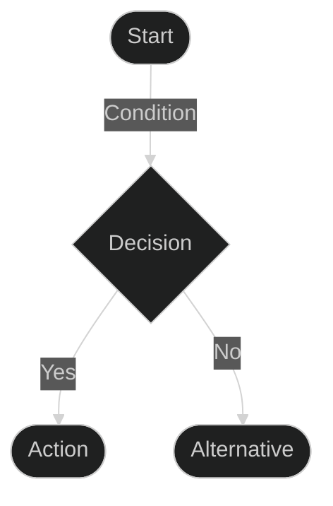
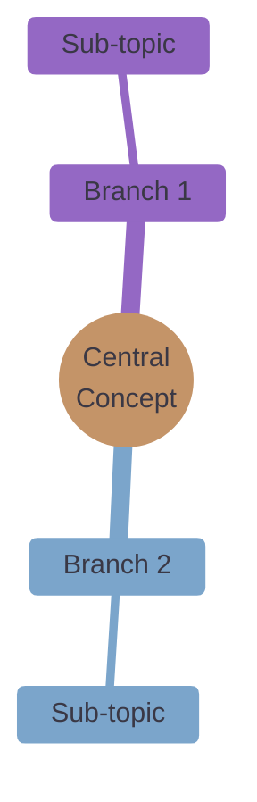
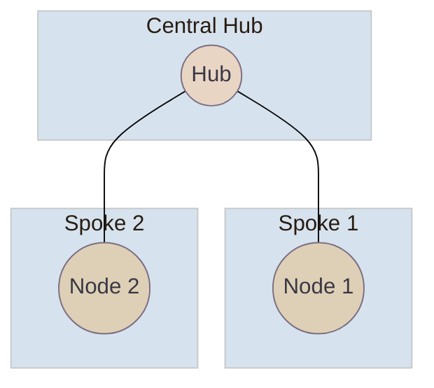

# Mermaid Style Guide

## Themes

We support two official themes:

### 1. Dark Theme (Technical Diagrams)
Use for technical flow diagrams, sequence diagrams, and architecture diagrams.

```css
%%{init: {
  'theme': 'dark',
  'themeVariables': {
    'darkMode': true,
    'background': '#252b32',
    'mainBkg': '#252b32',
    'textColor': '#c9d1d9',
    'lineColor': '#c9d1d9'
  }
}}%%
```

### 2. Pastel Theme (Conceptual Diagrams)
Use for mindmaps, concept maps, and organizational diagrams.

```css
%%{init: {
  'theme': 'base',
  'themeVariables': {
    'primaryColor': '#E8D5C4',
    'primaryTextColor': '#3A3845',
    'primaryBorderColor': '#7D6E83',
    'lineColor': '#7D6E83',
    'secondaryColor': '#DED0B6',
    'tertiaryColor': '#B7C4CF',
    'mainBkg': '#FFFFFF',
    'nodeBorder': '#7D6E83'
  }
}}%%
```

## Diagram Types

### 1. Flow Diagrams (Dark Theme)
Use for technical flows, processes, and architecture.



### 2. Mindmaps (Pastel Theme)
Use for concept exploration and hierarchical relationships.



### 3. Hub-Spoke Diagrams (Pastel Theme)
Use for distributed systems and organizational structures.



## Node Styles

- **Action Nodes**: Use `([Text])` syntax for dark theme
- **Decision Nodes**: Use `{Text}` syntax for dark theme
- **Mindmap Nodes**: Use `((Text))` syntax for root, plain text for branches
- **Hub-Spoke Nodes**: Use `((Text))` syntax with custom classes

## Essential Rules

1. **Theme Consistency**: 
   - Use dark theme for technical diagrams
   - Use pastel theme for conceptual diagrams
   - Never mix themes in the same diagram

2. **Node Styling**:
   - Follow node syntax conventions for each diagram type
   - Use custom classes only for hub-spoke diagrams
   - Keep text concise and readable

3. **Colors**:
   - Dark theme: Use theme defaults
   - Pastel theme: Use provided color palette
   - Ensure WCAG compliance for text contrast

4. **Layout**:
   - Keep diagrams clean and focused
   - Use appropriate spacing
   - Limit number of nodes for clarity

## Validation Checklist

### Dark Theme Technical Diagrams
- Uses correct theme configuration
- Proper node syntax
- No custom styling
- Clear flow direction

### Pastel Theme Conceptual Diagrams
- Uses pastel color palette
- WCAG compliant text contrast
- Appropriate diagram type selection
- Clean, hierarchical structure

### General Guidelines
- No emojis or icons
- Concise, descriptive text
- Logical flow and organization
- Professional appearance

## Why These Standards Matter

- **Consistency**: Unified visual language across documentation
- **Accessibility**: WCAG-compliant color contrasts
- **Clarity**: Different styles for different purposes
- **Professionalism**: Clean, focused diagrams

---
*Note: Always test diagrams for readability and WCAG compliance before committing.*
